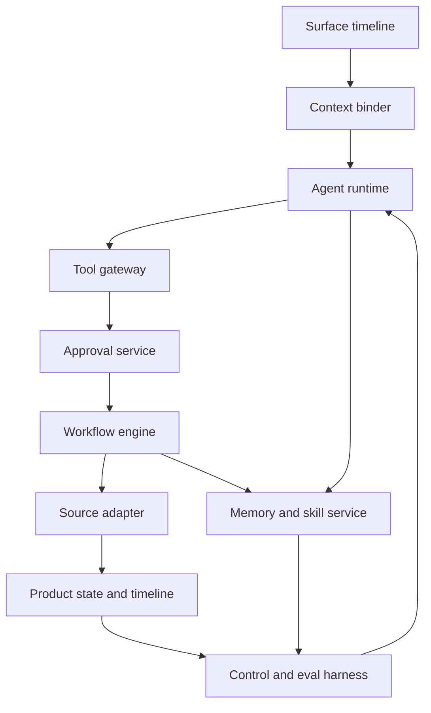

# Design Philosophy Lab

This note complements the interactive Design Philosophy section in [interactive.html](interactive.html#design-philosophy).

The purpose is to apply deep-module and information-hiding thinking to agent-native product architecture. An agent boundary is not good because it has a modern name. It is good when a small interface hides real complexity, owns a clear invariant, and lowers cognitive load for the teams that call it.

## Core Frame

Use this test for every proposed agent platform component:

```text
Module depth = useful behavior hidden behind the boundary / interface complexity exposed to callers
```

A deep module in this architecture is not "ContextBinder" because the class is named well. It is deep only if callers no longer need to know how identity claims, launch context, tenant scope, source ACLs, ambiguity checks, and clarification rules are resolved.

A shallow module is usually a renamed step:

```text
runAgentWithTools()
bookBed()
executeAction()
agentMemory
genericMcpServer()
```

Those names may be useful in a demo, but they leak decisions that a product must own explicitly.

## Simulated Design Review

This is a simulated discussion, not quotes from real people.

Simulated participants:

- Product architect: cares whether boundaries become reusable product infrastructure.
- Agent runtime engineer: cares about keeping model loops flexible enough for long-horizon work.
- Security and privacy owner: cares about authority, data class, audit, and denial evidence.
- Domain operations lead: cares about the actual work object, source truth, and recovery path.
- SRE and eval owner: cares about observability, reproducibility, rollout, and rollback.
- Ousterhout-style design reviewer: cares about module depth, information hiding, and cognitive load.

Discussion:

- Product architect: The product needs stable objects such as `AgentRun`, `ContextManifest`, `ToolCall`, `Approval`, `WorkflowEvent`, `MemoryProposal`, and `EvalCase`. Otherwise every new agent feature becomes bespoke glue.
- Agent runtime engineer: Do not freeze the inner loop too early. ReAct-style trajectories, tool use, handoffs, planning, and subagents need room to evolve. The runtime interface should return proposals, clarifications, refusals, and evidence, not domain writes.
- Security and privacy owner: Any interface that lets the model decide authority is shallow and unsafe. The policy gateway, approval service, and source adapter must enforce access outside the prompt.
- Domain operations lead: The agent is only useful if it is inside the work object. In healthcare, "book a bed" means encounter, unit, staffing, isolation, ADT, bed board, transport, and approval. A detached chat surface hides the wrong complexity.
- SRE and eval owner: A release is not a prompt edit. Each behavior change must pin model, prompt, toolset, policy, workflow, memory schema, eval run, rollout, and rollback controls.
- Ousterhout-style design reviewer: The red flags are change amplification and unknown unknowns. If adding a tool requires changes in UI, prompt, auth, workflow, audit, memory, and eval code by hand, the boundary is too shallow.

Synthesis:

The crux is not "which agent framework should we use?" The crux is where the product hides complexity. Agent SDKs, MCP servers, A2A delegation, workflow engines, and observability standards are useful only after the product decides which boundary owns identity, authority, state, memory, evidence, and release.

## Deep Boundary Matrix

| Boundary | Deep interface | Complexity hidden | Owned invariant | Shallow pattern to reject | Proof test |
|---|---|---|---|---|---|
| Surface timeline | `startAgentRunFromWorkObject(command, workObject)` | channels, timeline, correction, escalation | Every run is anchored to a visible work object | detached chat transcript | Every channel creates the same `AgentRun` and timeline event |
| Context binder | `bindContext(runRequest)` | tenant, role, launch context, source ACL, ambiguity | No reasoning before context and authority are bound | model infers "this patient" or "this account" | ambiguous object returns clarification and no tool call |
| Agent runtime | `runAgent(goal, context, allowedCapabilities)` | prompt, model, loop, budgets, stop rules | Runtime proposes; it does not authorize or write source truth | one runner that plans, authorizes, writes, and learns | side-effect fixtures stop before write |
| Tool gateway | `previewOrExecuteTool(toolCall, authority)` | schema, scope, data class, idempotency, timeout | Every tool call crosses policy before credentials are used | expose internal APIs directly as tools | denied scope creates `PolicyDecision`, no source call |
| Approval service | `requestApproval(actionPreview)` | payload hash, approver eligibility, expiry, resume token | Humans approve exact arguments, not vague intent | yes/no chat approval | argument change invalidates old approval |
| Workflow engine | `resumeWorkflow(approvedAction, idempotencyKey)` | waits, retries, cancellation, compensation, replay | Side effects and recovery live outside the model loop | one web request performs a business process | worker crash resumes without duplicate writes |
| Source adapter | `readOrWriteSource(contract, credential)` | provider API, mapping, staleness, reconciliation | Source systems remain authoritative | agent-owned cache becomes truth | stale source prevents completion |
| Memory and skill service | `proposeLearning(runEvidence)` | classification, retention, source links, review, rollback | No learning affects future runs without owner and eval coverage | auto-write every reflection to memory | sensitive or unsupported memories are unavailable |
| Control and eval harness | `promoteAgentRelease(bundle, evalReport)` | registry, grants, canary, incident pause, rollback | Behavior changes ship through pinned evidence gates | edit prompt and restart worker | any model, tool, prompt, policy, or memory change replays evals |

## How The Pieces Connect



The important design move is that each arrow crosses a contract. The caller should know the contract, not the implementation.

## Scenario Translation

### Healthcare Bed Flow

Request:

```text
Book a monitored bed for this ED patient.
```

Deep design:

- Surface timeline binds the voice command to the bed board or encounter.
- Context binder resolves encounter, facility, role, current bed-board timestamp, and SMART launch scope.
- Agent runtime reads constraints and proposes a bed hold.
- Tool gateway marks the write as approval-required and validates idempotency.
- Approval service captures the exact encounter, bed, hold duration, and evidence.
- Workflow engine reserves, notifies, waits, creates transport, and reconciles ADT.
- Source adapter treats EHR, ADT, and bed board as truth.
- Memory service rejects patient facts by default and converts process misses into evals or reviewed unit-level lessons.

### Enterprise Scheduling

The agent can rank slots and draft agenda text, but the deep boundary is the approval and workflow around external communication. The caller should not need to know calendar-provider event IDs, RSVP webhooks, timezone normalization, or CRM timeline internals.

### Support Resolution

The key deep boundary is splitting evidence gathering, financial action, and customer message. A shallow `resolveTicket()` tool would conflate policy interpretation, credit authority, outbound communication, and ticket closure.

### Code-Change Agent

Coding agents are the clearest analogy. The agent runtime can inspect, edit, and test inside a scoped workspace. Merge, deploy, secret access, and release promotion remain product boundaries with review and audit.

## Source Anchors

Papers and benchmarks give useful primitives:

- [ReAct](https://arxiv.org/abs/2210.03629): reason, act, observe trajectories.
- [MRKL](https://arxiv.org/abs/2205.00445): routing language models to external modules.
- [Toolformer](https://arxiv.org/abs/2302.04761): tool-call traces as learning data.
- [Reflexion](https://arxiv.org/abs/2303.11366), [Generative Agents](https://arxiv.org/abs/2304.03442), and [Voyager](https://arxiv.org/abs/2305.16291): memory, reflection, and skill libraries.
- [WebArena](https://arxiv.org/abs/2307.13854), [AgentBench](https://arxiv.org/abs/2308.03688), and [GAIA](https://arxiv.org/abs/2311.12983): long-horizon brittleness and failure taxonomy.
- [SWE-agent](https://arxiv.org/abs/2405.15793): the agent-computer interface affects outcomes.

Standards and protocols constrain boundaries:

- [MCP](https://modelcontextprotocol.io/specification/2025-11-25): useful connector shape for tools, resources, prompts, and transports.
- [A2A](https://a2a-protocol.org/latest/specification/): useful when another agent is a delegated actor, not just an API.
- [OpenTelemetry GenAI semantic conventions](https://opentelemetry.io/docs/specs/semconv/gen-ai/): useful trace vocabulary, not a compliance audit by itself.
- [OWASP Top 10 for LLM Applications](https://genai.owasp.org/llm-top-10/): useful threat model for prompt injection, excessive agency, disclosure, poisoning, and supply chain.
- [NIST AI RMF](https://www.nist.gov/itl/ai-risk-management-framework) and [ISO/IEC 42001](https://www.iso.org/standard/81230.html): governance, risk, and management-system anchors.
- [SMART App Launch](https://build.fhir.org/ig/HL7/smart-app-launch/scopes-and-launch-context.html) and [FHIR Encounter](https://build.fhir.org/encounter.html): healthcare context and source-resource anchors.

Platform cases show implementation pressure:

- [Cloudflare Agents](https://developers.cloudflare.com/agents/): stateful deployed agents, memory, real-time connections, schedules, and workflows.
- [Vercel AI SDK](https://ai-sdk.dev/docs/introduction): app-native tool loops, structured outputs, and UI integration.
- [OpenAI Agents SDK](https://openai.github.io/openai-agents-python/): agents, tools, handoffs, guardrails, sessions, and tracing.
- [LangGraph](https://docs.langchain.com/oss/python/langgraph/overview) and [Deep Agents](https://docs.langchain.com/oss/python/deepagents/overview): long-running state, interrupts, planning, subagents, filesystem-style context, and memory.

The product lesson is consistent: these are excellent building blocks, but none of them remove the need for product-owned boundaries.

## Review Checklist

Use this before promoting a component into platform architecture:

- Does the interface hide a hard decision or merely rename a sequence of calls?
- Does the caller need to know prompt layout, tool internals, token plumbing, source API quirks, memory store layout, or workflow retry rules?
- Which invariant does this boundary own?
- Which record proves the invariant held?
- Which test would fail if this boundary became shallow?
- Does a small product change require edits across many layers?
- Can the boundary be tested without a live model?
- Does it reduce cognitive load for product, platform, security, SRE, and domain teams?
