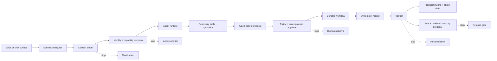

# Interactive Flow Tutorial

This tutorial uses one concrete request:

```text
Book a monitored bed for this ED patient.
```

The point is to see the crux of agent-native product architecture: the model can coordinate work, but the product must bind context, enforce authority, gate side effects, execute durably, verify source truth, and control learning.

<div class="agent-tutorial" data-agent-tutorial>
  <div class="tutorial-loading">Loading tutorial...</div>
</div>

## What To Notice

Use the scenario buttons to inject failures. The important design question is not "can the agent answer?" It is:

```text
Where must the product stop the run before harm, ambiguity, duplicate writes, stale approval, false completion, or unsafe memory?
```

When a scenario stops, inspect the records and the boundary panel. That is the architecture you need to build.

## Boundary Map



| Boundary | Product-owned question |
|---|---|
| Context binder | Which tenant, user, patient, encounter, facility, and source snapshot is this run allowed to use? |
| Capability layer | Which tools are visible after intersecting user role, agent grant, connector grant, source ACL, and risk level? |
| Policy gateway | Does this exact typed payload require approval, denial, rewrite, or extra evidence? |
| Durable workflow | How are retries, idempotency, cancellation, and compensation handled outside the model loop? |
| Verifier | What source-system fact proves the product can mark the task complete? |
| Learning gate | Which outcome becomes an eval, reviewed memory proposal, skill change, or release blocker? |
